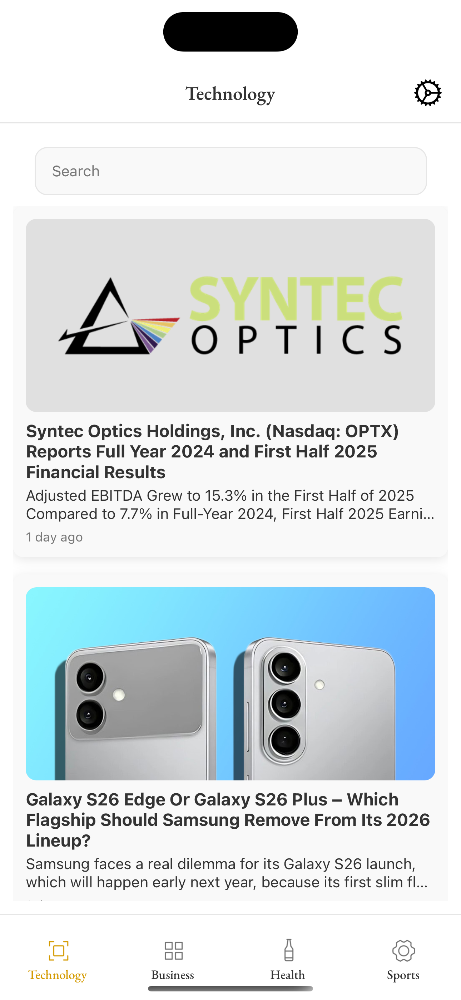
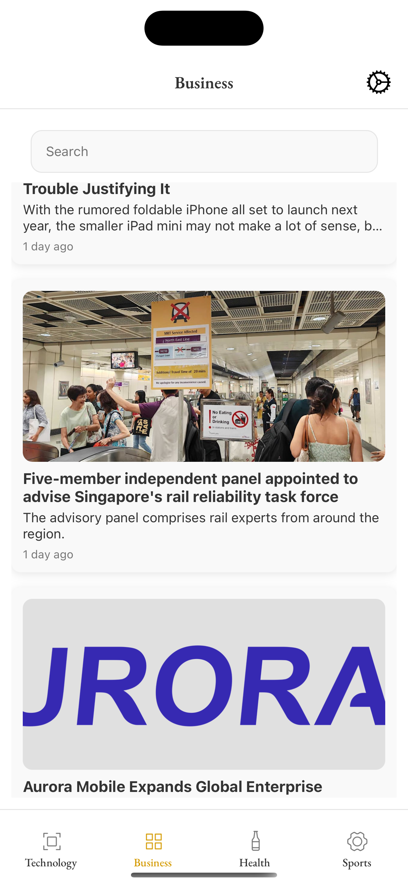
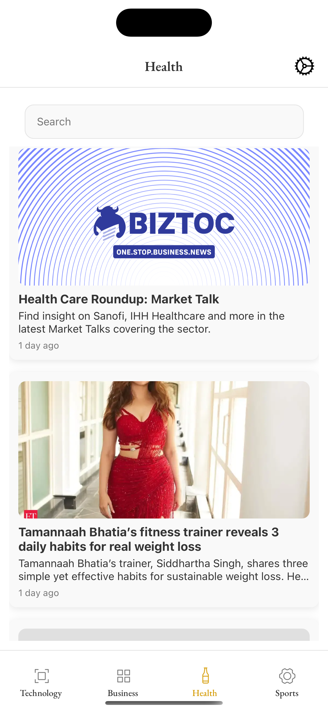
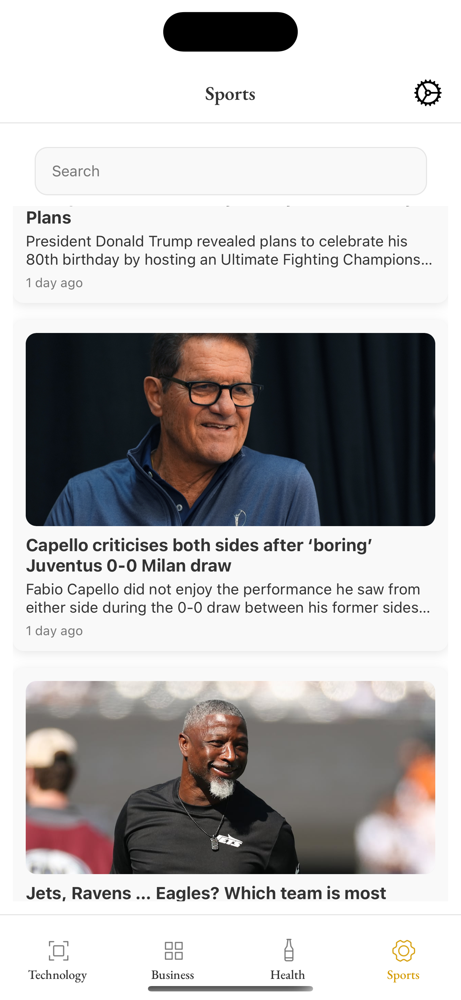
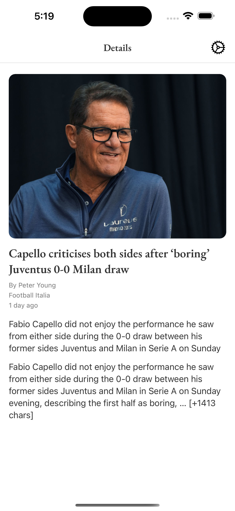
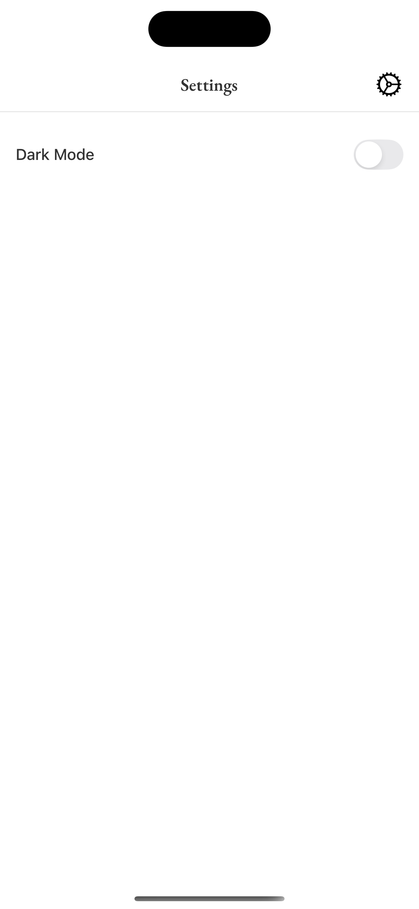

# 📰 News App

A modern **React Native (Expo)** application that displays categorized news articles with smooth UI, offline caching, and a dark/light mode toggle.  
Built for both **Android** and **iOS** using Expo and modular React architecture.

---

## 📸 Screenshots

| Technology Screen                                          | Business Screen                                          | Health Screen                                          | Sports Screen                                          | Article Details                                         | Settings                                                |
| ---------------------------------------------------------- | -------------------------------------------------------- | ------------------------------------------------------ | ------------------------------------------------------ | ------------------------------------------------------- | ------------------------------------------------------- |
|  |  |  |  |  |  |

---

## 🎥 Demo Video

[▶️ Watch Demo](https://drive.google.com/file/d/18ijK89p6OttdJaHOi9-49truBiUxKaci/view?usp=sharing)

---

## 🧱 Architecture Overview

The project follows a **scalable and modular architecture**, designed for easy maintenance and future growth.

src/
├── components/ # Reusable UI components (Card, SearchBar, Header)
├── context/ # Custom context providers (Auth, Theme)
├── hooks/ # Custom hooks (useFetch, useTheme, etc.)
├── navigation/ # All navigation setup (Stack, Tabs)
├── screens/ # Application screens (Technology, Business, Health, Sports, Details, Settings)
├── store/ # Redux Toolkit store + RTK Query slices
├── theme/ # Theme configuration (light & dark)
└── utils/ # Helper and utility functions

Key principles:

🔹 Separation of concerns (MVVM pattern)

View: Screens (UI only)

ViewModel: Redux slices / RTK Query for state & API logic

Service: API functions for fetching data

🔹 Reusable components

🔹 Centralized state management (Redux Toolkit + RTK Query)

🔹 Configurable themes (dark/light mode)

⚡ Features

✅ Fetches dynamic news articles from NewsAPI.org

✅ Category-based tab navigation: Technology, Business, Health, Sports
✅ Redux Toolkit + RTK Query for state management and API fetching
✅ Offline caching using AsyncStorage
✅ Pull-to-refresh on news lists
✅ Search functionality per category
✅ Smooth transitions and animations with Lottie
✅ Dark/Light theme toggle
✅ Responsive UI for Android and iOS
✅ Modular architecture for scalability

🛠 State Management

Redux Toolkit: Centralized state for news articles

RTK Query: Handles API calls and caching

MVVM Pattern:

Screens observe state only (View)

Redux slices / RTK Query act as ViewModel

Services handle API calls

📦 Local Caching

On app launch or when offline, cached articles are loaded from AsyncStorage

New data fetched online is automatically stored for offline access

⚙ Setup Instructions

Clone the repository:
git clone https://github.com/SheetalAlbiorix/krishna_news_task.git
cd krishna_news_task

Install dependencies:

npm install

# or

yarn install

Create a .env file with your NewsAPI key:

NEWS_API_KEY=your_api_key_here

Start the app:

npm start

# or

yarn start

📝 Notes
The Technology screen is fully implemented with Redux Toolkit + RTK Query; other screens follow the same pattern

Offline caching ensures that the app works without an internet connection

Dark/Light mode is applied globally via ThemeProvider
